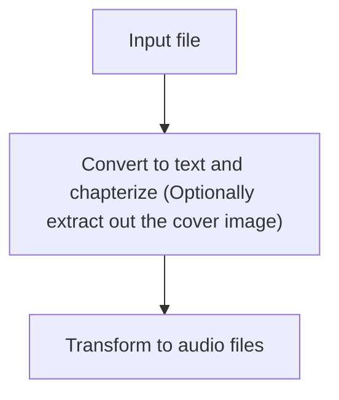

audiobook-generator - Generate audiobooks (epub) from ebooks (one mp3 per chapter)
==================================================================================

## Flow

## Usage

### Prerequisites
- Python 3.10+ (This program was tested on 3.12)
- (Optional) Install [espeak-ng](https://github.com/espeak-ng/espeak-ng) (On Debian/Ubuntu, run `apt install -y espeak-ng`)
- (Development only) [uv](https://github.com/astral-sh/uv)

### For End Users
- You DON'T need to clone this repository, but simply install it via `pip` (Virtual environment highly recommended, if you use `pipx` instead, virtual environments are automatically created for you.)
  - `pip install audiobook-generator`
- Convert your epub file to audiobooks via the command
  - `abg <epub path> <audio output directory>`
- If you want to see all the command line switches, just run `abg -h`

### For Development
- This program uses [`uv`](https://github.com/astral-sh/uv) for dependency management and execution in development, install it first if you haven't done so.
- To run the program from its source:
  - Clone this repository and `cd` inside.
  - (Do it ONCE only at the first time) Run `uv sync` to create the virtual environment in the `.env` directory and download all the dependencies.
  - Then run the following command
    - `uv run -m audiobook_generator.main ...`

### CPU or GPU?
The selection to run the model on CPU or GPU is automatic, meaning:
- On Windows/WSL/Linux, If you have Nvidia graphic card with the driver properly installed, the model will be loaded to GPU (cuda) and executed, otherwise, the CPU is used (which is slower compared to GPU)
- On Mac, you need to set the environment variable `PYTORCH_ENABLE_MPS_FALLBACK=1` for it to run on GPU (because at the time of writing, the MPS support in PyTorchis is not complete and it won't work without the CPU fallback), otherwise it will run on CPU.

*Tip*

You can use the following epub for testing:
https://github.com/daisy/epub-accessibility-tests/releases/download/fundamental-2.0/Fundamental-Accessibility-Tests-Basic-Functionality-v2.0.0.epub
