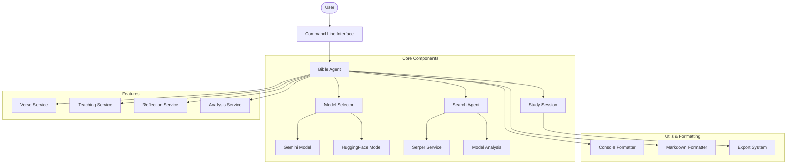

# Biblia: Bible Study AI Assistant 🤖📚

An intelligent assistant for biblical study and spiritual growth that combines modern AI with scriptural wisdom, featuring beautiful terminal-based UI.


## ✨ Features

- **Rich Terminal Interface**: Beautiful, colorful console output with proper formatting of headings, lists, and emphasis
- **AI-Powered Biblical Teaching**: Generate in-depth theological insights on any biblical topic
- **Daily Verse Devotionals**: Receive daily verses with AI-generated devotional content
- **Spiritual Reflections**: Create meaningful reflections on biblical passages and teachings
- **Markdown Export**: Save your study sessions in beautifully formatted Markdown files
- **Google Gemini Integration**: Leverages Google's powerful Gemini AI model for theological analysis

## 📸 Screenshots

<details>
<summary>Click to see Biblia in action</summary>

### Daily Verse


</details>

## 🚀 Installation

### From PyPI (Recommended)

```bash
pip install biblia
```

### From Source

```bash
git clone https://github.com/ashioyajotham/bible.git
cd bible
pip install -e .
```

## 🔑 Configuration

Create a `.env` file in your project directory:

```env
GEMINI_API_KEY=your_gemini_key
SERPER_API_KEY=your_serper_key  # For web search capabilities
ESV_API_KEY=your_esv_key        # For Bible verse lookup
```

## 📖 Usage

### Start Interactive Mode

```bash
bible
```

### Available Commands

- `teach (t)`: Get biblical teaching on a topic
- `verse (v)`: Get daily verse with devotional
- `reflect (r)`: Reflect on recent study
- `export (e)`: Export study session
- `help (h)`: Show help message
- `exit (q)`: Exit application

## 🏗️ Architecture



## 🛠️ Technical Components

- **Rich Console Interface**: Beautiful terminal UI with color, formatting, and proper Markdown rendering
- **Agent System**: Modular design with specialized agents for different tasks
- **AI Integration**: Google Gemini model for high-quality theological insights
- **Session Management**: Persistent study sessions that can be exported
- **Error Handling**: Graceful error handling and user-friendly messages

## 🙏 Contributing

Contributions are welcome! Please read our [contributing guidelines](CONTRIBUTING.md) for more details.

## 📜 License

MIT License - See [LICENSE](LICENSE) for more details.

## ⚠️ Note

This is an AI assistant tool meant to aid in Bible study, not replace traditional study methods or spiritual guidance.