# 🦋 blue-flie

🌀 `@flie` is an [`abcli`](https://github.com/kamangir/awesome-bash-cli) plugin for drone simulation and non-ROS robot control. See [blue-rover](https://github.com/kamangir/blue-rover) for ROS robots.

```bash
pip install blue-flie
```

```mermaid
graph LR
    gazebo_browse["@gazebo<br>browse -<br>&lt;object-name&gt;<br>gui|server"]

    gazebo_ingest_list["@gazebo<br>ingest<br>list"]

    gazebo_ingest_example["@gazebo<br>ingest -<br>example=&lt;example-name&gt;<br>&lt;object-name&gt;<br>browse"]

    gazebo_ingest_fuel["@gazebo<br>ingest -<br>fuel=&lt;fuel-name&gt;<br>&lt;object-name&gt;<br>browse"]

    examples["examples"]:::folder
    fuels["fuels"]:::folder
    object["📁 object"]:::folder
    UI["🖥️ UI"]:::folder

    object --> gazebo_browse
    gazebo_browse --> object
    gazebo_browse --> UI

    gazebo_ingest_list --> examples 

    examples --> gazebo_ingest_example
    gazebo_ingest_example --> object
    gazebo_ingest_example --> gazebo_browse

    fuels --> gazebo_ingest_fuel
    gazebo_ingest_fuel --> object
    gazebo_ingest_fuel --> gazebo_browse

    classDef folder fill:#999,stroke:#333,stroke-width:2px;
```



|   |   |   |
| --- | --- | --- |
| [`Swarm Simulation`](./blue_flie/docs/gazebo.md) [](./blue_flie/docs/gazebo.md) Simulating harm/cost for drone swarms with [Gazebo](https://gazebosim.org/home). | [`FPV`](./blue_flie/docs/fpv.md) [](./blue_flie/docs/fpv.md) FPVs available in the market | [`blue Crazy`](./blue_flie/docs/blue-crazy.md) [](./blue_flie/docs/blue-crazy.md) based on [Crazyflie 2.1 Brushless](https://www.bitcraze.io/products/crazyflie-2-1-brushless/) |
| [`blue Beast`](https://github.com/kamangir/blue-rover/blob/main/blue_rover/docs/blue-beast.md) [](https://github.com/kamangir/blue-rover/blob/main/blue_rover/docs/blue-beast.md) based on [UGV Beast PI ROS2](https://www.waveshare.com/wiki/UGV_Beast_PI_ROS2) | [`blue Amo`](https://github.com/kamangir/blue-assistant/blob/main/blue_assistant/script/repository/blue_amo/README.md) [](https://github.com/kamangir/blue-assistant/blob/main/blue_assistant/script/repository/blue_amo/README.md) Concept development with AI |  |

---


[](https://github.com/kamangir/blue-flie/actions/workflows/pylint.yml) [](https://github.com/kamangir/blue-flie/actions/workflows/pytest.yml) [](https://github.com/kamangir/blue-flie/actions/workflows/bashtest.yml) [](https://pypi.org/project/blue-flie/) [](https://pypistats.org/packages/blue-flie)

built by 🌀 [`blue_options-4.227.1`](https://github.com/kamangir/awesome-bash-cli), based on 🦋 [`blue_flie-4.122.1`](https://github.com/kamangir/blue-flie).
