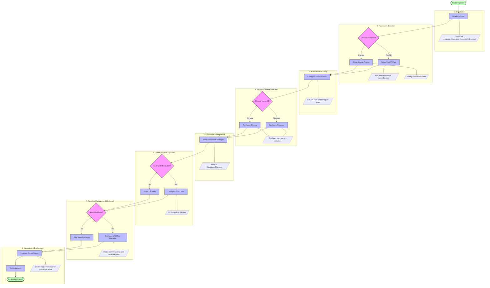
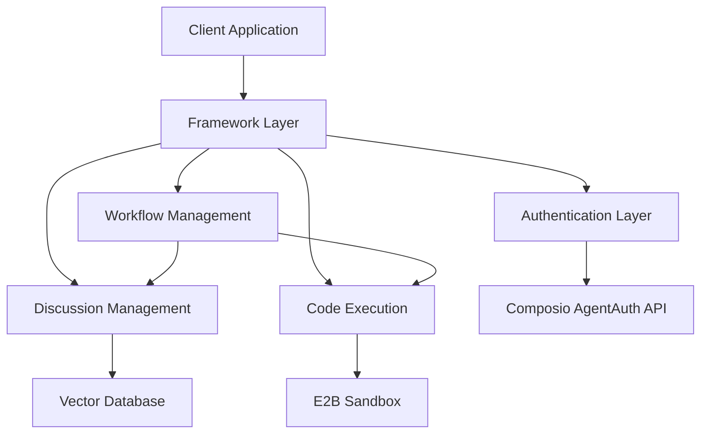
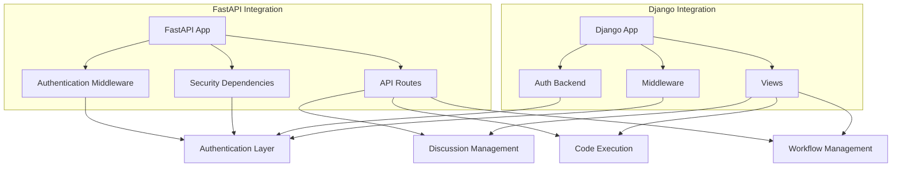

# Composio Agent Integration

[](https://badge.fury.io/py/composio-integration-frameworks)
[](https://github.com/Frontier-tech-consulting/composio_integration_frameworks/actions/workflows/tests.yml)
[](https://opensource.org/licenses/MIT)
[](https://pypi.org/project/composio-integration-frameworks/)

A comprehensive Python package for integrating Composio's AgentAuth architecture with FastAPI and Django web frameworks, along with vector database support, E2B code execution, and workflow management for AI agent applications.

## Features

- **Authentication & Authorization**
  - Seamless integration with Composio's AgentAuth
  - Role-based access control (client, admin)
  - Token management and validation

- **Framework Support**
  - FastAPI middleware and security dependencies
  - Django authentication backend and middleware
  - Framework-specific helpers for both platforms

- **Discussion Management**
  - Vector database storage (Pinecone, Chroma)
  - Semantic search for relevant discussions
  - User-specific discussion isolation

- **Code Execution**
  - Secure sandbox execution via E2B
  - Multiple language support (Python, JavaScript)
  - Synchronous and asynchronous execution

- **Workflow Management**
  - Multi-step workflow creation and execution
  - Parallel execution with dependencies
  - Code execution integration
  - Result storage and retrieval

- **Error Handling**
  - Comprehensive exception hierarchy
  - Detailed error messages and context
  - Framework-specific error responses

## Installation & Setup

```bash
# Basic installation
pip install composio_integration_frameworks

# Complete installation with all features
pip install composio_integration_frameworks[all]

# Selective installation
pip install composio_integration_frameworks[fastapi,pinecone,e2b]  # FastAPI with Pinecone and E2B
pip install composio_integration_frameworks[django,chroma]         # Django with Chroma
```

### Environment Variables

Set these environment variables based on your configuration needs:

```bash
# Core Authentication
export COMPOSIO_API_KEY="your-api-key"
export COMPOSIO_API_URL="https://api.composio.dev/v1/"

# Vector Database (choose one)
# For Pinecone
export PINECONE_API_KEY="your-pinecone-api-key"
export PINECONE_ENVIRONMENT="your-pinecone-environment"
export PINECONE_INDEX="composio-discussions"

# For Chroma
export CHROMA_PERSIST_DIRECTORY="./chroma_db"

# E2B Code Execution
export E2B_API_KEY="your-e2b-api-key"
export E2B_EXECUTION_TIMEOUT="300"  # in seconds

# Workflow Management
export WORKFLOW_STORAGE_PATH="./workflows"
```

## Source Build & Package Development

To build the package from source and develop locally:

```bash
# Clone the repository
git clone https://github.com/Frontier-tech-consulting/composio_integration_frameworks.git
cd composio_integration_frameworks

# Create and activate a virtual environment
python -m venv venv
source venv/bin/activate  # On Windows: venv\Scripts\activate

# Install development dependencies
pip install -e ".[test]"

# Install in development mode with all dependencies
pip install -e ".[all]"

# Run tests
pytest

# Build the package
pip install build
python -m build
```

### Troubleshooting Installation Issues

If you encounter errors during installation, try these steps:

1. **Package structure issues**: Ensure your directory structure matches the package configuration
   ```bash
   # Check that these directories exist at the root level
   ls -la auth discussion utils generators e2b_interpreter fastapi django workflows
   ```

2. **TOML parsing errors**: If you get TOML parsing errors, check your pyproject.toml file
   ```bash
   # Validate your TOML file
   pip install tomli
   python -c "import tomli; tomli.loads(open('pyproject.toml', 'rb').read())"
   ```

3. **Dependency conflicts**: Try installing with fewer extras at a time
   ```bash
   pip install -e ".[fastapi]"
   pip install -e ".[django]"
   # Then add other extras one by one
   ```

### Publishing Updates

When updating the package, follow these steps:

1. Update version in `setup.py` and `pyproject.toml`
2. Update CHANGELOG.md with your changes
3. Build the distribution:
   ```bash
   python -m build
   ```
4. Upload to PyPI:
   ```bash
   python -m twine upload dist/*
   ```

## Publishing to PyPI

This package uses GitHub Actions for automated publishing to PyPI. The publishing process is triggered either by creating a new release on GitHub or by manually running the workflow.

### Automated Publishing with GitHub Releases

1. Go to the GitHub repository
2. Click on "Releases" in the right sidebar
3. Click "Create a new release"
4. Enter a tag version (e.g., `v0.1.0`)
5. Enter a release title and description
6. Click "Publish release"

The GitHub Actions workflow will automatically build and publish the package to PyPI.

### Manual Publishing

1. Go to the GitHub repository
2. Click on "Actions" in the top navigation
3. Select the "Publish to PyPI" workflow
4. Click "Run workflow"
5. Enter the version number (e.g., `0.1.0`)
6. Click "Run workflow"

The workflow will update the version in the package files, create a tag, and publish to PyPI.

### Setting Up PyPI Trusted Publishing

To set up trusted publishing with PyPI:

1. Create an account on PyPI if you don't have one
2. Register your package name on PyPI
3. Go to your package settings on PyPI
4. Under "Publishing", click "Add a new pending publisher"
5. Enter your GitHub repository details:
   - Owner: `Frontier-tech-consulting`
   - Repository name: `composio_integration_frameworks`
   - Workflow name: `publish.yml`
6. Click "Add"
7. Approve the publisher in PyPI

This setup allows GitHub Actions to publish to PyPI without storing API tokens.

## Integration Process

The following diagram shows the step-by-step process for integrating the Composio framework:



## Architecture

The package follows a modular architecture designed for flexibility and extensibility:



### Core Components

- **Authentication Layer**: Handles user authentication, token validation, and role-based access control
- **Discussion Management**: Stores and retrieves discussions using vector databases
- **Code Execution**: Executes code in secure sandboxes via E2B
- **Workflow Management**: Orchestrates multi-step workflows with dependencies

### Framework Integration



## API Endpoints

### FastAPI Endpoints

| Endpoint | Method | Description | Example Request | Example Response |
|----------|--------|-------------|----------------|------------------|
| `/auth/register` | POST | Register a new user | `{"username": "user", "password": "pass", "email": "user@example.com", "role": "client"}` | `{"user_id": "123", "token": "jwt-token"}` |
| `/auth/login` | POST | Login and get token | `{"username": "user", "password": "pass"}` | `{"token": "jwt-token"}` |
| `/auth/me` | GET | Get current user info | Headers: `Authorization: Bearer jwt-token` | `{"user_id": "123", "username": "user", "role": "client"}` |
| `/discussions` | POST | Add a discussion | `{"message": "Hello, AI"}` | `{"id": "disc-123", "status": "success"}` |
| `/discussions/search` | GET | Search discussions | Query: `?query=AI&limit=5` | `[{"message": "Hello, AI", "timestamp": "2023-01-01T12:00:00Z"}]` |
| `/e2b/execute` | POST | Execute code | `{"code": "print('Hello')", "language": "python"}` | `{"success": true, "outputs": [...], "result": {...}}` |
| `/e2b/schedule` | POST | Schedule code execution | `{"code": "print('Hello')", "language": "python"}` | `{"execution_id": "exec-123", "status": "scheduled"}` |
| `/workflows` | POST | Create workflow | `{"name": "Data Analysis", "steps": [...]}` | `{"id": "wf-123", "name": "Data Analysis", "status": "pending"}` |
| `/workflows/{id}/execute` | POST | Execute workflow | `{"inputs": {"param": "value"}}` | `{"workflow_id": "wf-123", "status": "completed", "steps_results": {...}}` |

### Django URL Patterns

| URL Pattern | View | Description | Example Usage |
|-------------|------|-------------|--------------|
| `auth/login/` | `login_view` | Login with AgentAuth | POST with username/password |
| `auth/logout/` | `logout_view` | Logout current user | GET/POST request |
| `discussions/add/` | `add_discussion_view` | Add a discussion | POST with message |
| `discussions/search/` | `search_discussions_view` | Search discussions | GET with query parameter |
| `e2b/execute/` | `execute_code_view` | Execute code | POST with code and language |
| `workflows/create/` | `create_workflow_view` | Create workflow | POST with workflow definition |
| `workflows/<id>/execute/` | `execute_workflow_view` | Execute workflow | POST with inputs |

## Usage Examples

### Basic Authentication

```python
from auth.client import register_user, login_user, get_user_info

# Register a new user
user_data = register_user(
    username="john_doe",
    password="secure_password",
    email="john@example.com",
    role="client"
)

# Login to get a token
token = login_user("john_doe", "secure_password")

# Get user information
user_info = get_user_info(token)
print(f"Logged in as: {user_info['username']} (Role: {user_info['role']})")
```

### FastAPI Integration

```python
from fastapi import FastAPI, Depends
from fastapi.security import AgentAuthSecurity
from discussion.manager import DiscussionManager
from e2b_interpreter.client import E2BClient
from workflows.manager import WorkflowManager

# Initialize components
app = FastAPI()
auth_security = AgentAuthSecurity()
discussion_mgr = DiscussionManager(vector_db_type="pinecone")
e2b_client = E2BClient()
workflow_mgr = WorkflowManager(
    discussion_manager=discussion_mgr,
    e2b_client=e2b_client
)

# Secure endpoint example
@app.post("/chat")
async def chat(message: str, user=Depends(auth_security)):
    # Store the user's message
    discussion_mgr.add_discussion(user["user_id"], message)
    
    # Execute code if needed
    if "run code:" in message:
        code = message.split("run code:")[1].strip()
        result = await e2b_client.execute_code(code, user["user_id"])
        return {"message": "Code executed", "result": result}
    
    # Get relevant discussions
    discussions = discussion_mgr.get_relevant_discussions(user["user_id"], message)
    return {"message": "Message stored", "relevant_discussions": discussions}
```

### Django Integration

```python
# In views.py
from django.http import JsonResponse
from django.contrib.auth.decorators import login_required
from django.discussion import add_discussion, get_relevant_discussions
from django.e2b import execute_code

@login_required
def chat_view(request):
    message = request.POST.get("message", "")
    
    # Store the user's message
    add_discussion(request, message)
    
    # Execute code if needed
    if "run code:" in message:
        code = message.split("run code:")[1].strip()
        result = execute_code(request, code)
        return JsonResponse({"message": "Code executed", "result": result})
    
    # Get relevant discussions
    discussions = get_relevant_discussions(request, message)
    return JsonResponse({"message": "Message stored", "relevant_discussions": discussions})
```

### Workflow Example

```python
from workflows.models import StepType
from workflows.manager import WorkflowManager

# Initialize workflow manager
workflow_mgr = WorkflowManager(
    discussion_manager=discussion_mgr,
    e2b_client=e2b_client
)

# Create a data analysis workflow
workflow = workflow_mgr.create_workflow(
    name="Data Analysis",
    description="Analyze CSV data",
    steps=[
        {
            "name": "Load Data",
            "type": StepType.CODE_EXECUTION.value,
            "config": {
                "code": "import pandas as pd\ndata = pd.read_csv('data.csv')\ndata.head()",
                "language": "python"
            }
        },
        {
            "name": "Analyze",
            "type": StepType.CODE_EXECUTION.value,
            "config": {
                "code": "data.describe()",
                "language": "python"
            },
            "depends_on": ["load-data"]
        }
    ]
)

# Execute the workflow
result = await workflow_mgr.execute_workflow(workflow.id)
```

## Exception Handling

The package provides a comprehensive exception hierarchy for robust error handling:

```python
# Authentication exceptions
from auth.exceptions import (
    AuthException,                # Base exception
    InvalidCredentialsError,      # Wrong username/password
    TokenExpiredError,            # Expired token
    AdminRequiredError            # Admin role required
)

# Discussion exceptions
from discussion.exceptions import (
    DiscussionException,          # Base exception
    VectorDBError,                # Vector database issues
    UserDiscussionAccessError     # Access control violation
)

# Code execution exceptions
from e2b_interpreter.exceptions import (
    CodeInterpreterException,     # Base exception
    SandboxError,                 # Sandbox issues
    ExecutionError                # Code execution failure
)

# Workflow exceptions
from workflows.exceptions import (
    WorkflowError,                # Base exception
    WorkflowNotFoundError,        # Workflow not found
    WorkflowExecutionError        # Execution failure
)
```

## Contributing

Contributions are welcome! Please feel free to submit a Pull Request.

1. Fork the repository
2. Create your feature branch (`git checkout -b feature/amazing-feature`)
3. Commit your changes (`git commit -m 'Add some amazing feature'`)
4. Push to the branch (`git push origin feature/amazing-feature`)
5. Open a Pull Request

## License

This project is licensed under the MIT License - see the LICENSE file for details.