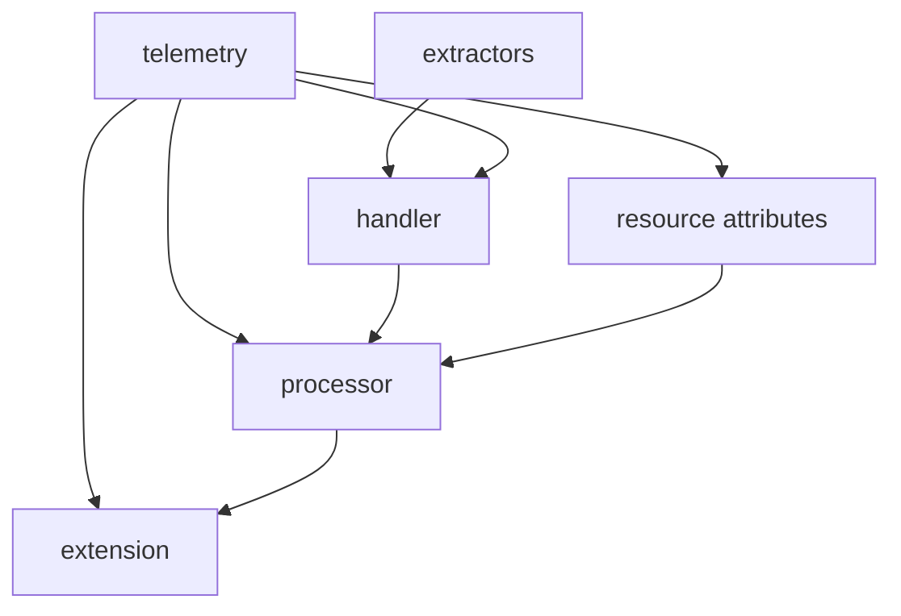
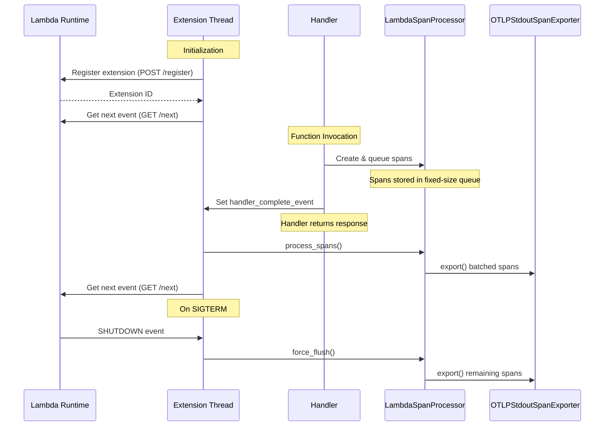

# Lambda OTel Lite

The `lambda-otel-lite` library provides a lightweight, efficient OpenTelemetry implementation specifically designed for AWS Lambda environments. It features a custom span processor and internal extension mechanism that optimizes telemetry collection for Lambda's unique execution model.

By leveraging Lambda's execution lifecycle and providing multiple processing modes, this library enables efficient telemetry collection with minimal impact on function latency. By default, it uses the [otlp-stdout-span-exporter](https://pypi.org/project/otlp-stdout-span-exporter) to export spans to stdout for the [serverless-otlp-forwarder](https://github.com/dev7a/serverless-otlp-forwarder) project.

>[!IMPORTANT]
>This package is highly experimental and should not be used in production. Contributions are welcome.

## Features

- **Flexible Processing Modes**: Support for synchronous, asynchronous, and custom export strategies
- **Automatic Resource Detection**: Automatic extraction of Lambda environment attributes
- **Lambda Extension Integration**: Built-in extension for efficient telemetry export
- **Efficient Memory Usage**: Queue-based buffering to prevent memory growth
- **AWS Event Support**: Automatic extraction of attributes from common AWS event types
- **Flexible Context Propagation**: Support for W3C Trace Context and custom propagators

## Architecture and Modules

The library follows a modular architecture where each component has a specific responsibility while working together efficiently:



- `telemetry`: Core initialization and configuration
  - Main entry point via `init_telemetry`
  - Configures global tracer and span processors
  - Returns a `TelemetryCompletionHandler` for span lifecycle management

- `processor`: Lambda-optimized span processor
  - Queue-based implementation
  - Multiple processing modes
  - Coordinates with extension for async export

- `extension`: Lambda Extension implementation
  - Manages extension lifecycle and registration
  - Handles span export coordination
  - Implements graceful shutdown

- `extractors`: Event processing
  - Built-in support for API Gateway and ALB events
  - Extensible interface for custom events
  - W3C Trace Context propagation

## Installation

```bash
# Requires Python 3.12+
pip install lambda_otel_lite

# Optional: For OTLP HTTP export support
pip install "lambda_otel_lite[otlp-http]"
```

## Quick Start

```python
from lambda_otel_lite import init_telemetry, create_traced_handler
from lambda_otel_lite.extractors import api_gateway_v2_extractor
from opentelemetry import trace

# Initialize telemetry once, outside the handler
tracer, completion_handler = init_telemetry()

# Create traced handler with configuration
traced = create_traced_handler(
    name="my-handler",
    completion_handler=completion_handler,
    attributes_extractor=api_gateway_v2_extractor,  # Optional: Use event-specific extractor
)

def process_event(event):
    # Your business logic here
    return {
        "statusCode": 200,
        "body": "Success"
    }

@traced
def handler(event, context):
    # Access current span via OpenTelemetry API
    current_span = trace.get_current_span()
    current_span.set_attribute("custom", "value")
    
    # Your handler code here
    result = process_event(event)
    return result
```

## Processing Modes

The library supports three processing modes for span export:

1. **Sync Mode** (default):
   - Direct, synchronous export in handler thread
   - Recommended for low-volume telemetry or when latency is not critical
   - Set via `LAMBDA_EXTENSION_SPAN_PROCESSOR_MODE=sync`

2. **Async Mode**:
   - Export via Lambda extension using AWS Lambda Extensions API
   - Spans are queued and exported after handler completion
   - Uses event-based communication between handler and extension
   - Registers specifically for Lambda INVOKE events
   - Implements graceful shutdown with SIGTERM handling
   - Error handling for:
     - Event communication failures
     - Export failures
     - Extension registration issues
   - Best for production use with high telemetry volume
   - Set via `LAMBDA_EXTENSION_SPAN_PROCESSOR_MODE=async`

3. **Finalize Mode**:
   - Registers extension with no events
   - Maintains SIGTERM handler for graceful shutdown
   - Ensures all spans are flushed during shutdown
   - Compatible with BatchSpanProcessor for custom export strategies
   - Best for specialized export requirements where you need full control
   - Set via `LAMBDA_EXTENSION_SPAN_PROCESSOR_MODE=finalize`

### Async Processing Mode Architecture




The async mode leverages Lambda's extension API to optimize perceived latency by deferring span export until after the response is sent to the user. The diagram above shows the core coordination between components:

1. Extension thread registers and waits for events from Runtime
2. Handler queues spans during execution via LambdaSpanProcessor
3. Handler signals completion via event before returning
4. Extension processes and exports queued spans after handler completes
5. Extension returns to waiting for next event
6. On shutdown, remaining spans are flushed and exported

## Event Extractors

Built-in extractors for common Lambda triggers:

```python
from lambda_otel_lite.extractors import (
    api_gateway_v1_extractor,  # API Gateway REST API
    api_gateway_v2_extractor,  # API Gateway HTTP API
    alb_extractor,            # Application Load Balancer
    default_extractor,        # Basic Lambda attributes
)
```

Custom extractors can be created by implementing the extractor interface:

```python
from lambda_otel_lite.extractors import SpanAttributes, TriggerType

def custom_extractor(event, context) -> SpanAttributes:
    return SpanAttributes(
        trigger=TriggerType.OTHER,  # Or any custom string
        attributes={
            "custom.attribute": "value",
            # ... other attributes
        },
        span_name="custom-operation",  # Optional
        carrier=event.get("headers"),  # Optional: For context propagation
    )
```

## Advanced Usage

### Custom Resource

```python
from opentelemetry.sdk.resources import Resource

# Add custom resource attributes
resource = Resource.create({
    "custom.attribute": "value",
})

# Initialize with custom resource
completion_handler = init_telemetry(resource=resource)
```

### Custom Span Processors

For advanced use cases, you can use custom span processors. For example, to use the OTLP HTTP exporter:

```bash
# First install the optional dependency:
pip install "lambda_otel_lite[otlp-http]"
```

```python
from opentelemetry.sdk.trace import BatchSpanProcessor
from opentelemetry.exporter.otlp.proto.http.trace_exporter import OTLPSpanExporter

# Configure custom processors
processors = [
    BatchSpanProcessor(OTLPSpanExporter()),
]

# Initialize with custom processors
tracer, completion_handler = init_telemetry(span_processors=processors)
```

## Automatic FAAS Attributes

The library automatically sets relevant FAAS attributes based on the Lambda context and event:

| Attribute Type | Attribute Name | Source | Description |
|----------------|----------------|---------|-------------|
| Resource Attributes | `cloud.provider` | "aws" | Cloud provider identifier |
| | `cloud.region` | AWS_REGION | AWS region where function runs |
| | `faas.name` | AWS_LAMBDA_FUNCTION_NAME | Lambda function name |
| | `faas.version` | AWS_LAMBDA_FUNCTION_VERSION | Function version ($LATEST or version number) |
| | `faas.instance` | AWS_LAMBDA_LOG_STREAM_NAME | Unique instance identifier |
| | `faas.max_memory` | AWS_LAMBDA_FUNCTION_MEMORY_SIZE | Maximum memory in bytes |
| | `service.name` | OTEL_SERVICE_NAME or function name | Service identifier |
| | Additional attributes | OTEL_RESOURCE_ATTRIBUTES | Custom key-value pairs |
| Span Attributes | `faas.coldstart` | Runtime detection | Boolean flag set to true only on first invocation |
| | `faas.invocation_id` | Lambda request ID | Unique invocation identifier |
| | `cloud.account.id` | Function ARN | AWS account ID |
| | `cloud.resource_id` | Function ARN | Complete function ARN |
| HTTP Attributes | `faas.trigger` | Event type detection | "http" for API/ALB events |
| | `http.method` | Event source | HTTP method (GET, POST, etc.) |
| | `http.target` | Event source | Request path |
| | `http.route` | Event source | Route pattern or resource path |
| | `http.status_code` | Response | HTTP status code if present |
| | `url.path` | Event source | Request path |
| | `url.query` | Event source | Query string parameters |
| | `url.scheme` | Event source | Protocol (https for API Gateway, http for ALB) |
| | `network.protocol.version` | Event source | HTTP version (e.g., "1.1") |
| | `client.address` | Event source | Client IP address |
| | `user_agent.original` | Event source | User agent string |
| | `server.address` | Event source | Server hostname |
| | `alb.target_group_arn` | Event source | ALB target group ARN (ALB only) |

## Environment Variables

The library can be configured using the following environment variables:

### Processing Configuration
- `LAMBDA_EXTENSION_SPAN_PROCESSOR_MODE`: Controls span processing strategy
  - `sync`: Direct export in handler thread (default)
  - `async`: Deferred export via extension
  - `finalize`: Custom export strategy
- `LAMBDA_SPAN_PROCESSOR_QUEUE_SIZE`: Maximum number of spans to queue (default: 2048)
- `LAMBDA_SPAN_PROCESSOR_BATCH_SIZE`: Maximum number of spans to export in each batch (default: 512)

### Resource Configuration
- `OTEL_SERVICE_NAME`: Override the service name (defaults to function name)
- `OTEL_RESOURCE_ATTRIBUTES`: Additional resource attributes in key=value,key2=value2 format

### Export Configuration
- `OTLP_STDOUT_SPAN_EXPORTER_COMPRESSION_LEVEL`: Gzip compression level for stdout exporter
  - 0: No compression
  - 1: Best speed
  - 6: Good balance between size and speed (default)
  - 9: Best compression

### Logging
- `AWS_LAMBDA_LOG_LEVEL` or `LOG_LEVEL`: Configure log level (debug, info, warn, error, none)

### AWS Lambda Environment
The following AWS Lambda environment variables are automatically used for resource attributes:
- `AWS_REGION`: Region where function runs
- `AWS_LAMBDA_FUNCTION_NAME`: Function name
- `AWS_LAMBDA_FUNCTION_VERSION`: Function version
- `AWS_LAMBDA_LOG_STREAM_NAME`: Log stream name
- `AWS_LAMBDA_FUNCTION_MEMORY_SIZE`: Function memory size

## Error Handling

The library provides automatic error tracking and span status updates based on handler behavior:

### HTTP Response Status
If your handler returns a standard HTTP response object, the status code is automatically recorded:
```python
@traced
def handler(event, context):
    try:
        result = process_event(event)
        return {
            "statusCode": 200,
            "body": "Success"
        }
    except ValueError as e:
        # Return a 4xx response - this won't set the span status to ERROR
        return {
            "statusCode": 400,
            "body": str(e)
        }
    except Exception as e:
        # Return a 5xx response - this will set the span status to ERROR
        return {
            "statusCode": 500,
            "body": "Internal error"
        }
```

Any response with status code >= 500 will automatically set the span status to ERROR.

### Exception Handling
While the library will automatically record uncaught exceptions, it's recommended to handle exceptions explicitly in your handler:

```python
@traced
def handler(event, context):
    try:
        # Your code here
        raise ValueError("invalid input")
    except ValueError as e:
        # Record the error and set appropriate status
        current_span = trace.get_current_span()
        current_span.record_exception(e)
        current_span.set_status(StatusCode.ERROR, str(e))
        return {
            "statusCode": 400,
            "body": str(e)
        }
```

This gives you more control over:
- Which exceptions to record
- What status code to return
- What error message to include
- Whether to set the span status to ERROR

Uncaught exceptions will still be recorded as a fallback, but this should be considered a last resort.

## Local Development

### Building the Package

The package uses static versioning with version numbers defined in both `pyproject.toml` and `__init__.py`. Version tags follow the format `python/lambda-otel-lite/vX.Y.Z` (e.g., `python/lambda-otel-lite/v0.8.0`).

When building locally:

```bash
# Install build dependencies
pip install build

# Build the package
python -m build
```

### Installing for Development

For development, install in editable mode with dev dependencies:

```bash
# Create and activate a virtual environment
python -m venv .venv
source .venv/bin/activate  # or `.venv\Scripts\activate` on Windows

# Install in editable mode with dev dependencies
pip install -e ".[dev]"
```

### Running Tests

```bash
# Run all tests
pytest

# Run with coverage
pytest --cov

# Run specific test file
pytest tests/test_handler.py
```

### Code Quality

```bash
# Format code
ruff format .

# Run linter
ruff check .

# Run type checker
mypy src/lambda_otel_lite
```

## License

MIT 