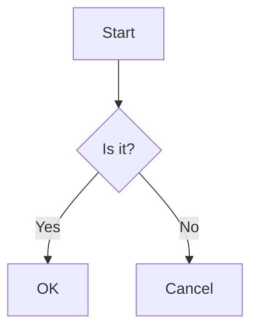

# MermaidMD2PDF

A powerful command-line tool that converts Markdown documents containing Mermaid diagrams into beautifully formatted PDFs.

## Features

- Convert Markdown files with Mermaid diagrams to PDF
- Support for multiple Mermaid diagram types
- High-quality PDF output with embedded diagrams
- Command-line interface for easy integration
- Comprehensive error handling and validation

## Prerequisites

- Python 3.8 or higher
- Pandoc (for PDF generation)
- Mermaid CLI (for diagram rendering)

### Installing Prerequisites

#### macOS
```bash
# Install Pandoc
brew install pandoc

# Install Mermaid CLI
npm install -g @mermaid-js/mermaid-cli
```

#### Linux
```bash
# Install Pandoc
sudo apt-get install pandoc

# Install Mermaid CLI
npm install -g @mermaid-js/mermaid-cli
```

## Installation

1. Clone the repository:
```bash
git clone https://github.com/yourusername/MermaidMD2PDF.git
cd MermaidMD2PDF
```

2. Create and activate a virtual environment:
```bash
python -m venv .venv
source .venv/bin/activate  # On Linux/macOS
# or
.venv\Scripts\activate  # On Windows
```

3. Install the package:
```bash
pip install -e .
```

## Usage

Basic usage:
```bash
mermaidmd2pdf input.md output.pdf
```

### Command Line Options

- `--title TEXT`: Set the PDF title
- `--help`: Show help message and exit
- `--version`: Show version and exit

### Example Markdown File

```markdown
# My Document

This is a sample document with a Mermaid diagram.



## Documentation

- [User Guide](docs/user-guide/README.md)
- [API Reference](docs/api-reference/README.md)
- [Examples](docs/examples/README.md)

## Development

### Running Tests

```bash
pytest
```

### Code Style

This project uses:
- Black for code formatting
- isort for import sorting
- mypy for type checking
- ruff for linting

Run all checks:
```bash
pre-commit run --all-files
```

## License

This project is licensed under the MIT License - see the [LICENSE](LICENSE) file for details.
