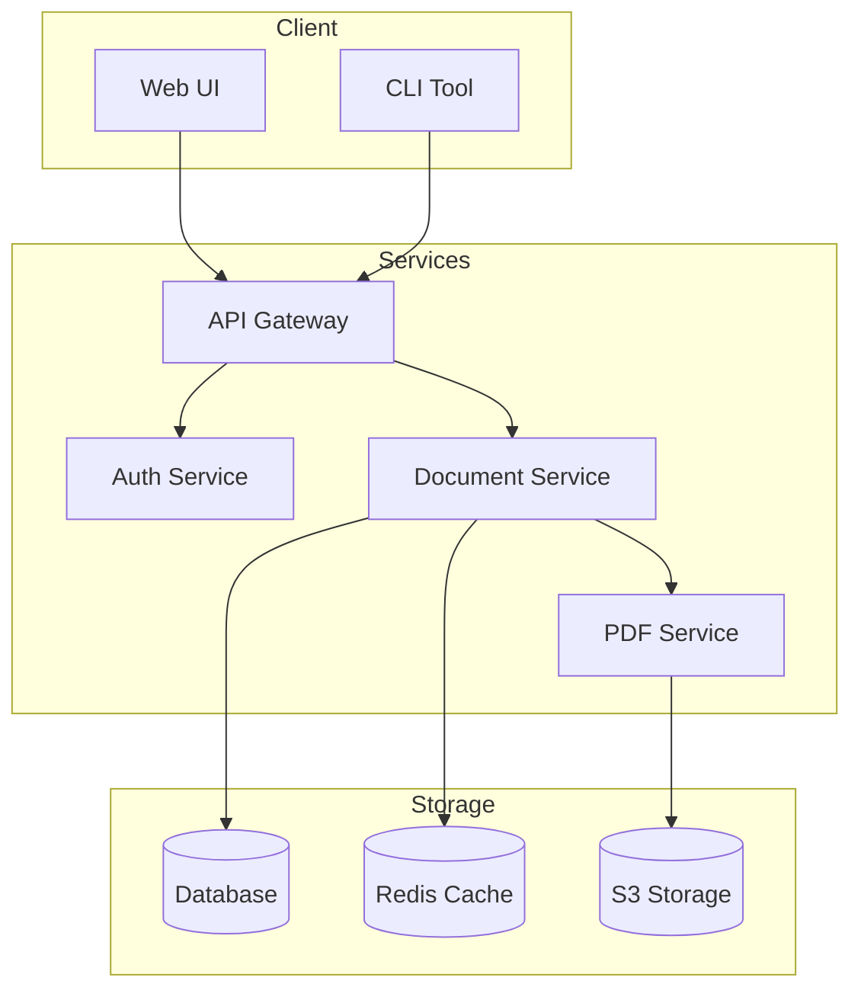
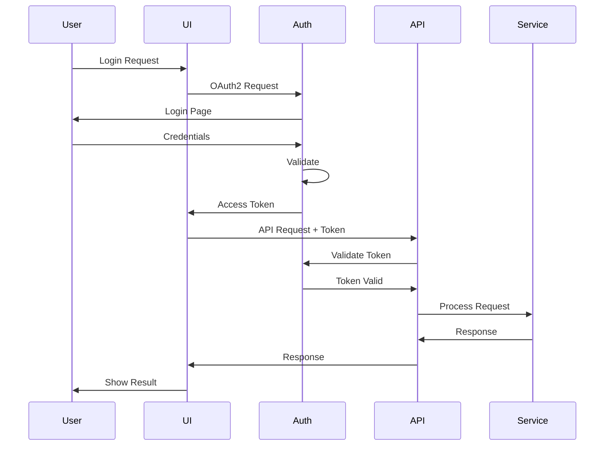
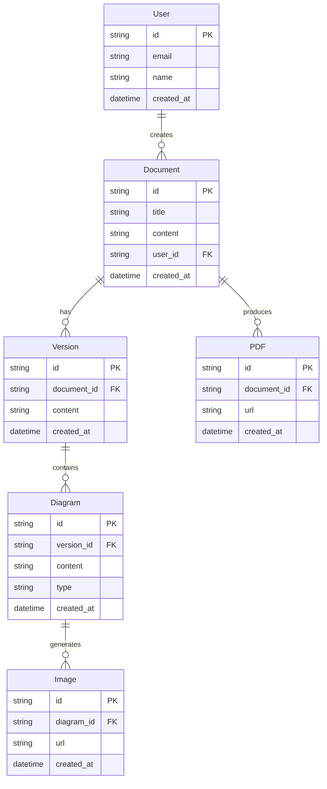
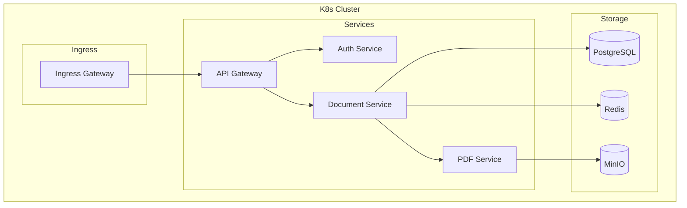
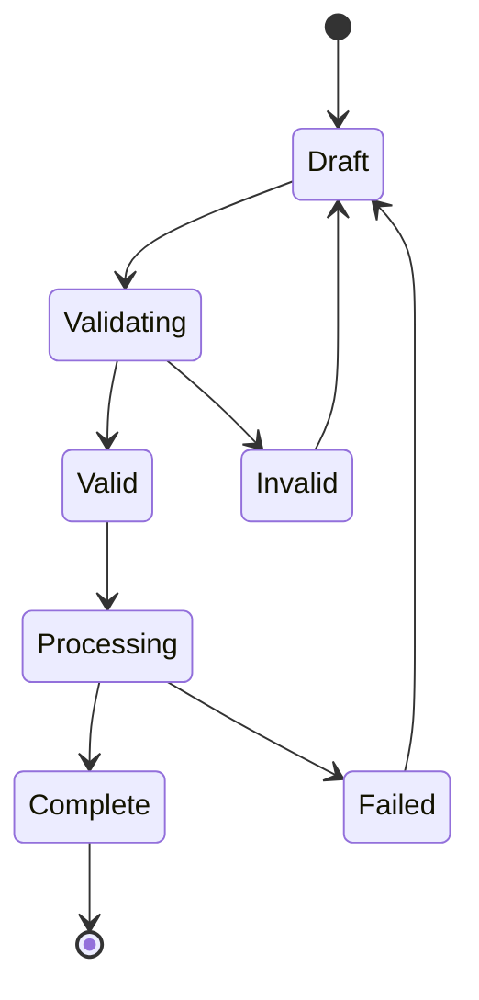
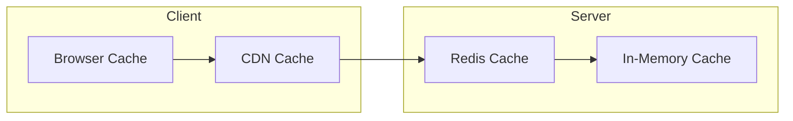
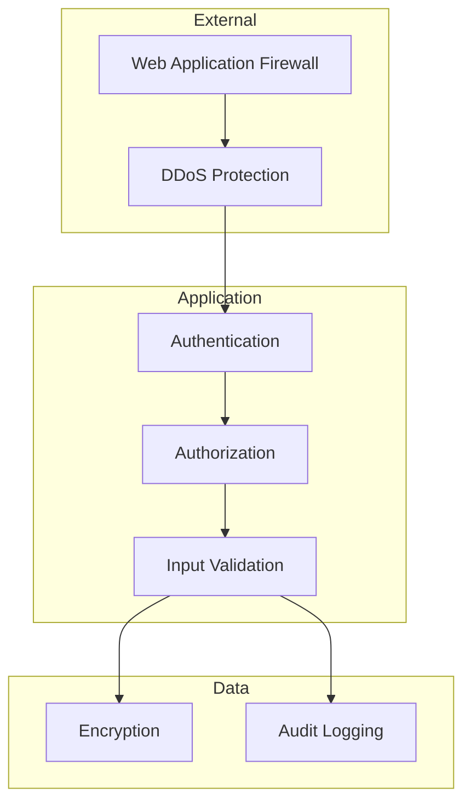

# System Architecture Documentation

This document demonstrates how to create a comprehensive system architecture documentation using MermaidMD2PDF.

## System Overview

Our system is a distributed microservices architecture that handles document processing and PDF generation.

## Authentication Flow

The system uses OAuth2 for authentication. Here's the flow:

## Data Model

The system uses a relational database with the following core entities:

## Deployment Architecture

The system is deployed using Kubernetes:

## State Management

The document processing workflow follows this state machine:

## Performance Considerations

The system implements caching at multiple levels:

## Security Architecture

The security model follows a defense-in-depth approach:

