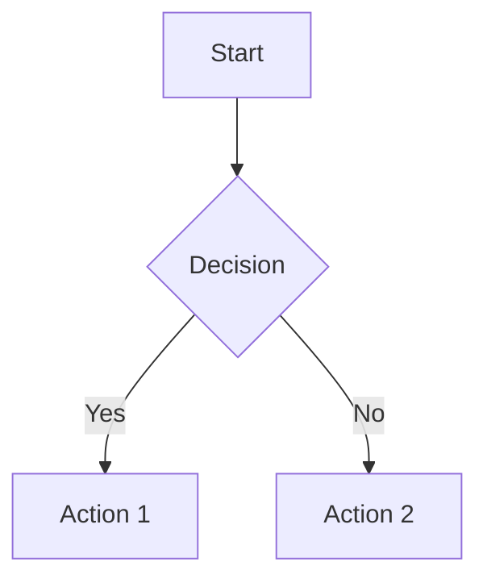
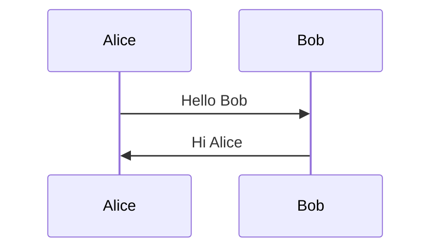
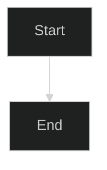
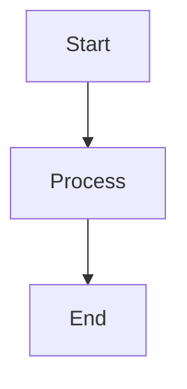

# MermaidMD2PDF User Guide

This guide provides detailed information about using MermaidMD2PDF to convert Markdown documents with Mermaid diagrams to PDF.

## Table of Contents

1. [Getting Started](#getting-started)
2. [Basic Usage](#basic-usage)
3. [Advanced Features](#advanced-features)
4. [Troubleshooting](#troubleshooting)
5. [Examples](#examples)

## Getting Started

### Prerequisites

Before using MermaidMD2PDF, ensure you have the following installed:

1. Python 3.8 or higher
2. Pandoc (for PDF generation)
3. Mermaid CLI (for diagram rendering)

See the main README for installation instructions for your operating system.

### Installation

1. Install MermaidMD2PDF using pip:
```bash
pip install mermaidmd2pdf
```

2. Verify the installation:
```bash
mermaidmd2pdf --version
```

## Basic Usage

### Converting a Simple Document

The basic command to convert a Markdown file to PDF is:

```bash
mermaidmd2pdf input.md output.pdf
```

### Adding a Title

To set a custom title for your PDF:

```bash
mermaidmd2pdf --title "My Document" input.md output.pdf
```

### Supported Mermaid Diagram Types

MermaidMD2PDF supports all standard Mermaid diagram types:

- Flowcharts
- Sequence diagrams
- Class diagrams
- State diagrams
- Entity Relationship diagrams
- User Journey diagrams
- Gantt charts

Example of a flowchart:
```markdown

```

Example of a sequence diagram:
```markdown

```

## Advanced Features

### Customizing Diagram Styles

You can customize diagram styles using Mermaid's built-in theme options:

```markdown

```

### Handling Multiple Diagrams

MermaidMD2PDF automatically handles multiple diagrams in a single document:

```markdown
# My Document

## Process Flow


## System Architecture

```

## Troubleshooting

### Common Issues

1. **Missing Dependencies**
   - Error: "Pandoc not found"
   - Solution: Install Pandoc using your system package manager

2. **Invalid Mermaid Syntax**
   - Error: "Invalid diagram syntax"
   - Solution: Check the Mermaid syntax in your diagram

3. **File Permission Issues**
   - Error: "Permission denied"
   - Solution: Ensure you have write permissions in the output directory

### Getting Help

- Use `mermaidmd2pdf --help` for command-line help
- Check the [GitHub Issues](https://github.com/yourusername/MermaidMD2PDF/issues) for known problems
- Create a new issue if you encounter a bug

## Examples

See the [examples directory](../examples) for sample documents and their corresponding PDF outputs.
