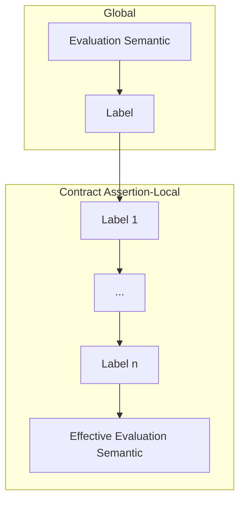

# Pactum

[](https://github.com/jan-moeller/pactum/actions/workflows/python-package.yml)

Pactum is a Python library designed to help both library implementers and their users to write
correct code. It provides decorators for adding contract annotations, serving multiple purposes:

1. **Documentation**  
   Contracts provide clear and precise specification using Python expressions instead of
   comments.
2. **Runtime Verification**  
   Contracts enable runtime verification, helping catch bugs early in the development process.
3. **Static Analysis**  
   Contracts can also be used for static analysis, although this would require additional
   implementation effort from third-party tools, which is unlikely to happen.

## Overview

_Contract assertions_ are a mechanism to specify and potentially enforce conditions that must hold
at certain points of the program. Their key components are:

1. **Predicate**  
   This is the condition that must be true for the assertion to hold.
2. **Bound Variables**  
   This is the set of variables accessible to the predicate, e.g. function arguments.
3. **Evaluation Semantic**  
   The evaluation semantic determines whether the assertion is evaluated at runtime, or not.
4. **Labels**  
   Labels can be attached to contract assertions to influence the effective evaluation semantic for
   that assertion.

Pactum knows two kinds of contract assertions:
1. **Preconditions**  
   Defined using the `@pre` decorator, indicates that a condition must hold before a function is
   executed or a scope is entered.
2. **Postconditions**  
   Defined using the `@post` decorator, indicates that a condition must hold after a function executed
   or a scope is left.

## Usage Example

```python
@pre(lambda ip: is_valid_ip(ip))
@pre(lambda port: is_valid_port(port))
@post(lambda result: is_valid_http_status(result))
def get_from_network(ip: str, port: int) -> int:
    """Opens a network connection and returns the HTTP status code"""
    return connect_impl(ip, port)  # does the actual work
```

## Contract Predicates

A contract predicate is a `bool`-returning callable. In its simplest form, a predicate has no
parameters. However, it is often useful for a predicate to be able to access surrounding variables.
To that end, predicates can accept arguments.

### Predicate Parameters

Predicate parameters must satisfy the following constraints:

1. they must be of kind POSITIONAL_OR_KEYWORD (i.e. the declaration must not contain `*` or `/`
   parameters) [^1]
2. their name must be in the set of visible [bindings](#anchor-bindings)

[^1]: This precludes variadic parameters such as `*args` and `**kwargs`.

<a name="anchor-bindings"></a>

### Predicate Bindings

Variables can be explicitly bound to make them available in the predicate. For example, in
preconditions, the function arguments are implicitly bound, and can therefore be accessed by default,
simply by giving the predicate parameters of the same name as the decorated function parameter.

Other variables can be bound explicitly by using the `capture` and `clone` family of assertion
parameters. Captured variables reference the same object, which means it could change between the
moment it was captured and the predicate is evaluated. Cloned variables on the other hand are deep
copied, and are therefore guaranteed to remain unchanged.

For example, it is possible to access local and/or global variables:

```python
# ...
answer = 1  # partial result


# We know the actual answer is greater than the partial answer previously computed
@post(
    lambda result, old_answer: old_answer < result,
    capture_before={"old_answer": "answer"},  # capture answer before modification
)
def compute_answer():
    """This is going to take a while"""
    global answer
    answer = 42
    return answer  # Really long computation

```

## Evaluation Semantics

By default, all contract assertions are runtime-evaluated. Pactum offers a range of knobs to change
that behavior.


### Global Evaluation Semantic

At the outermost level, Pactum offers a global switch:

```python
# Turn off all (?) runtime checking
set_contract_evaluation_semantic(EvaluationSemantic.ignore)
```

### Labels

Contract assertions can have labels which can affect the effective evaluation semantic for that
assertion. Labels are attached to assertions with the `labels` keyword argument, for example:

```python
@pre(lambda: predicate(), labels=[labels.expensive])
```

Currently, the library comes with two labels that make sense on assertions:

1. **expensive**  
   This label is supposed to mark very expensive contract checks, and allows turning those off
   separately.
2. **ignore**  
   This label unconditionally turns of this contract assertion. This might be useful during
   development to temporarily silence flaky assertions.

Additionally, there is a configurable global label, which affects all contract assertions. The
library currently ships two labels meant for use as global label:

1. **ignore_postconditions**  
   This label turns off all postconditions.
2. **filter_by_module**  
   Technically a label factory, this allows to only turn on assertions in specific modules.

For example:

```python
set_global_contract_assertion_label(labels.filter_by_module("mymodule.*"))
```

This graph shows the steps taken to determine the effective semantic:



## Contract Kinds

### Preconditions

Preconditions are expected to hold _before_ the function/scope is entered. Since it's so common
(and safe), function arguments are implicitly bound to preconditions.

|                           | Decorator                                           | Context manager                |
|---------------------------|-----------------------------------------------------|--------------------------------|
| Function arguments        | Implicitly captured, `capture={...}`, `clone={...}` | ❌                              |
| Return value              | ❌                                                   | ❌                              |
| Variables before entering | `capture={...}`, `clone={...}`                      | `capture={...}`, `clone={...}` |
| Labels                    | `labels=[...]`                                      | `labels=[...]`                 |

Example:

```python
with pre(lambda a, b: a == b, capture={"a": "foo"}, clone={"b": "bar"}, labels=[labels.expensive]):
    """In here, a==b, where a refers to some outer variable called foo, and b is a deep copy of
    variable "bar". This precondition is marked as expensive."""
```

### Postconditions

Postconditions are expected to hold _after_ the function/scope exits. Since it is very common to
access the function's return value in a postcondition, the first parameter not otherwise bound is
assumed to refer to the return value.

|                           | Decorator                                    | Context manager                              |
|---------------------------|----------------------------------------------|----------------------------------------------|
| Function arguments        | `capture_before={...}`, `clone_before={...}` | ❌                                            |
| Return value              | first unbound parameter                      | ❌                                            |
| Variables before entering | `capture_before={...}`, `clone_before={...}` | `capture_before={...}`, `clone_before={...}` |
| Variables after exiting   | `capture_after={...}`, `clone_after={...}`   | `capture_after={...}`, `clone_after={...}`   |
| Labels                    | `labels=[...]`                               | `labels=[...]`                               |

## References

[PEP-0316](https://peps.python.org/pep-0316/) **Programming by Contract for Python**  
This PEP wants to add contracts to the language. It has been around since 2003. I don't know what
its status is.

[P2900](https://wg21.link/p2900) **Contracts for C++**  
A proposal to add contracts to C++. I took some inspiration from there.