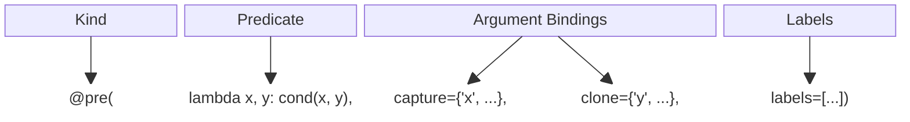

# PyPactum

[](https://github.com/jan-moeller/pactum/actions/workflows/python-package.yml)

PyPactum is a Python library designed to help both library implementers and their users to write
correct code. It provides decorators for adding contract annotations, serving multiple purposes:

1. **Documentation**  
   Contracts provide clear and precise specification using Python expressions instead of
   comments.
2. **Runtime Verification**  
   Contracts enable runtime verification, helping catch bugs early in the development process.
3. **Static Analysis**  
   Contracts can also be used for static analysis, although this would require additional
   implementation effort from third-party tools, which is unlikely to happen.

## Usage Example

```python
@pre(lambda ip: is_valid_ip(ip))
@pre(lambda port: is_valid_port(port))
@post(lambda result: is_valid_http_status(result))
def get_from_network(ip: str, port: int) -> int:
    """Opens a network connection and returns the HTTP status code"""
    return connect_impl(ip, port)  # does the actual work
```

## Overview

_Contract assertions_ are a mechanism to specify and potentially enforce conditions that must hold
at certain points of the program.

The four key concepts are:

1. **[Contract Kind](/docs/contract_kinds.md)**  
   PyPactum knows preconditions, postconditions, and invariants.
2. **[Predicate](/docs/predicates.md)**  
   Predicates encapsulate the condition that must be true for an assertion to hold.
3. **[Argument Bindings](/docs/argument_binding.md)**  
   Binding variables such as arguments or the function result value makes them accessible to the
   predicate.
4. **[Labels](/docs/evaluation_semantic.md)**  
   Labels can be attached to contract assertions to influence the effective evaluation semantic for
   that assertion.

For example, for preconditions:



## References

[PEP-0316](https://peps.python.org/pep-0316/) **Programming by Contract for Python**  
This PEP wants to add contracts to the language. It has been around since 2003. I don't know what
its status is.

[P2900](https://wg21.link/p2900) **Contracts for C++**  
A proposal to add contracts to C++. I took some inspiration from there.