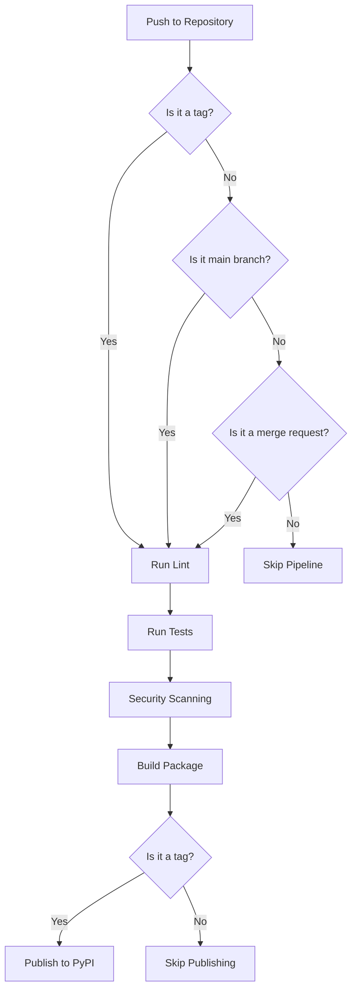

# PyPI Publishing Workflow (ʘ‿ʘ)✧

This document explains the automated workflow for publishing the `pytruststore` package to PyPI using GitLab CI/CD.

## Overview 🔍

Our CI/CD pipeline automates the following steps:

1. **Linting**: Checks code quality using Ruff
2. **Testing**: Runs unit tests with pytest
3. **Security Scanning**: Performs SAST analysis
4. **Building**: Creates distribution packages
5. **Publishing**: Uploads packages to PyPI (only on tags)

## Workflow Diagram 📊



## How to Release a New Version 🚀

To publish a new version to PyPI:

1. Update the version number in `pyproject.toml`
2. Commit the changes
3. Create and push a tag with the version number:

```bash
# Update version in pyproject.toml to 0.1.1
git add pyproject.toml
git commit -m "Bump version to 0.1.1 (╯°□°）╯︵ ┻━┻"
git tag v0.1.1
git push origin main v0.1.1
```

The CI/CD pipeline will automatically:
- Run all tests and checks
- Build the package
- Publish to PyPI (because you pushed a tag)

## CI/CD Configuration ⚙️

The workflow is defined in `.gitlab-ci.yml` with the following stages:

### Lint Stage

Checks code quality using Ruff:

```yaml
lint:
  stage: lint
  image: python:${PYTHON_VERSION}
  script:
    - pip install uv
    - uv pip install ruff
    - uv pip install .
    - ruff check .
```

### Test Stage

Runs unit tests with pytest:

```yaml
test:
  stage: test
  image: python:${PYTHON_VERSION}
  script:
    - pip install uv
    - uv pip install pytest
    - uv pip install .
    - pytest
```

### Build Stage

Creates distribution packages:

```yaml
build:
  stage: build
  image: python:${PYTHON_VERSION}
  script:
    - pip install build
    - python -m build
  artifacts:
    paths:
      - dist/
```

### Publish Stage

Uploads packages to PyPI (only on tags):

```yaml
publish_pypi:
  stage: publish
  image: python:${PYTHON_VERSION}
  script:
    - pip install twine
    - TWINE_PASSWORD=${PYPI_API_TOKEN} TWINE_USERNAME=__token__ twine upload dist/*
  rules:
    - if: $CI_COMMIT_TAG =~ /^v\d+\.\d+\.\d+/
```

## Required CI/CD Variables 🔐

For the publishing step to work, you need to set up the following CI/CD variable in GitLab:

| Variable | Description | Type |
|----------|-------------|------|
| `PYPI_API_TOKEN` | PyPI API token for authentication | Protected, Masked |

To set this up:

1. Go to your GitLab project
2. Navigate to Settings → CI/CD → Variables
3. Add a new variable named `PYPI_API_TOKEN`
4. Set the value to your PyPI API token
5. Mark it as "Protected" and "Masked"

## Troubleshooting 🔧

### Pipeline Fails at Publish Stage

If the pipeline fails during the publish stage, check:

1. **API Token**: Ensure your PyPI API token is correctly set up in GitLab CI/CD variables
2. **Version Number**: Make sure you're not trying to publish a version that already exists on PyPI
3. **Package Name**: Verify the package name isn't already taken by someone else

### Tests Failing

If tests are failing:

1. Run tests locally to debug: `pytest -v`
2. Check if dependencies are correctly specified in `pyproject.toml`
3. Ensure test fixtures are properly set up

### Build Issues

If the build stage fails:

1. Try building locally: `python -m build`
2. Check for any syntax errors or import issues
3. Verify your `pyproject.toml` is correctly formatted

## Manual Publishing 🔨

If you need to publish manually:

```bash
# Install build tools
pip install build twine

# Build the package
python -m build

# Upload to PyPI
twine upload dist/*
```

When prompted, enter your username as `__token__` and your password as the PyPI API token.

## Best Practices 🌟

1. **Always increment the version number** before releasing
2. **Use semantic versioning** (MAJOR.MINOR.PATCH)
3. **Tag releases** with a 'v' prefix (e.g., v0.1.0)
4. **Test the package locally** before pushing a tag
5. **Review the CI/CD pipeline** after pushing to ensure everything passes
