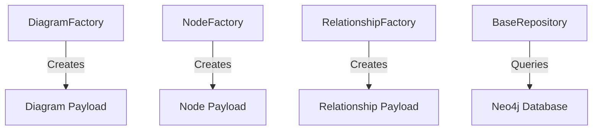

# std-methods

`std-methods` is a utility library that provides a standardised set of methods to build domain-specific payloads and interact with Neo4j databases. The package includes:

## Features

### Factories:
- **DiagramFactory**: Easily create diagram payloads with default values (or use custom builder functions).
- **NodeFactory**: Build standardised payloads for various node types (such as "function" or "element").
- **RelationshipFactory**: Generate relationship payloads for connecting nodes (or create custom relationship models).

### Repository Base:
- **BaseRepository**: A foundational class for interacting with a Neo4j database. It handles connection initialisation, simple query execution, and proper closure of connections.

### Utility Functions:
- **generate_id**: A helper function that creates unique IDs with a specified prefix using Python’s `uuid` module.

## Installation

You can install the package directly from PyPI:

```sh
pip install std-methods
```
## Usage

Once installed, you can import and use the provided components in your Python code.

### Importing the Package

```python
from std_methods import (
    DiagramFactory,
    NodeFactory,
    RelationshipFactory,
    BaseRepository,
    generate_id
)
```

### Creating Diagrams

The `DiagramFactory` helps you create diagram payloads. It can use default values or a custom builder if registered.

```python
# Create a generic diagram payload:
diagram = DiagramFactory.create_diagram("flow", name="My Flow Diagram")
print(diagram)
```

#### Example Output:
```json
{
  "id": "Dgm-<uuid>",
  "name": "My Flow Diagram",
  "description": "No description provided",
  "project_id": "Unassigned Project",
  "placements": [],
  "extra_info": "",
  "type": "FLOW"
}
```

#### Register a Custom Builder

```python
def custom_diagram_builder(id, name, description, project_id, placements, extra_info, type):
    return {
        "diagram_id": id,
        "title": name,
        "details": description,
        "project": project_id,
        "data": placements,
        "extra": extra_info,
        "diagram_type": type,
    }

DiagramFactory.register_builder("custom", custom_diagram_builder)
custom_diagram = DiagramFactory.create_diagram("custom", name="Custom Diagram")
print(custom_diagram)
```

### Creating Nodes

Use `NodeFactory` to create node payloads for different types.

```python
# Create a function node payload:
function_node = NodeFactory.create_node(
    "function",
    name="Process Data",
    description="Processes input data and produces outputs."
)
print(function_node)
```

```python
# Create an element node payload:
element_node = NodeFactory.create_node("element", name="Element 1", document_ids=["doc1", "doc2"])
print(element_node)
```

### Creating Relationships

`RelationshipFactory` standardizes the creation of relationships between nodes.

```python
# Create a relationship between two nodes:
relationship = RelationshipFactory.create_relationship(
    "depends_on",
    source_id="N-123",
    target_id="N-456"
)
print(relationship)
```

### Using the BaseRepository

`BaseRepository` provides a simple way to interact with a Neo4j database.

```python
from std_methods import BaseRepository

# Initialize the repository (connection details can be overridden via parameters or environment variables)
repo = BaseRepository(uri="bolt://localhost:7687", user="neo4j", password="secret")

# Execute a query:
try:
    result = repo.execute_query("MATCH (n) RETURN n LIMIT 5")
    print("Query results:", result)
finally:
    repo.close()
```

### Utility Function: `generate_id`

Generate unique IDs for your objects with a specific prefix:

```python
unique_id = generate_id("N")
print("Generated ID:", unique_id)
```




## Linting and Testing

This package is fully tested using `pytest` and linted with `ruff`. To run tests and check linting locally:

### Run Tests:

```sh
pytest
```

### Run Linter (Ruff):

```sh
ruff .
```

> **Note:** If you encounter any false positives (for instance, with your re-exported modules in `__init__.py`), see the linter configuration section in our documentation.

## Contributing

Contributions are welcome! Please follow these steps:

1. Fork the repository.
2. Create a new branch for your feature or bug fix.
3. Write tests for your changes.
4. Ensure that `pytest` and `ruff` pass without errors.
5. Submit a pull request with a detailed description of your changes.


