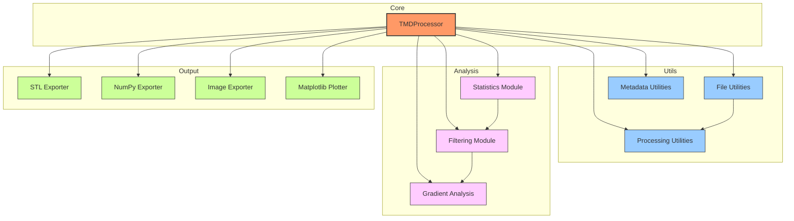
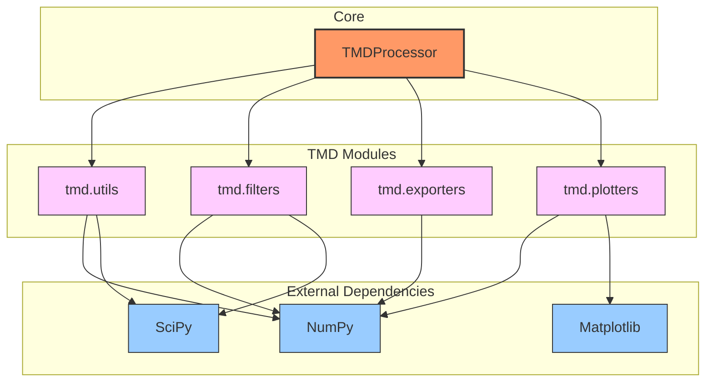
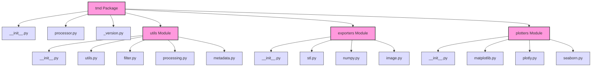
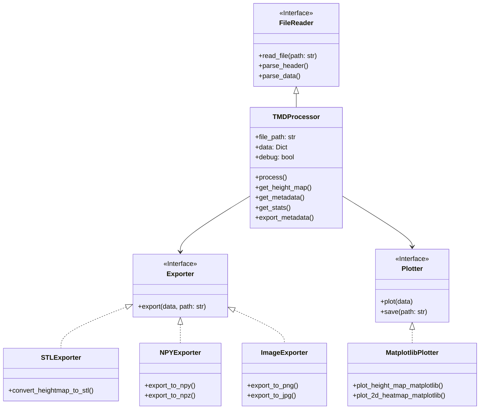
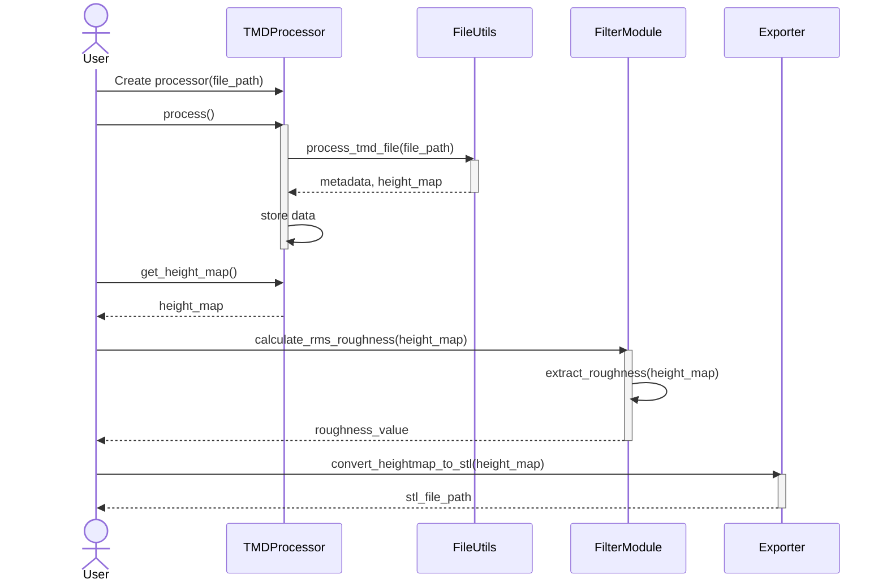

# TMD Component Diagram

This page shows the relationships between various components of the TMD library.

## Core Components

The TMD library consists of several core components that work together to provide a complete workflow for processing and analyzing TMD files.

## Component Dependencies

This diagram shows the dependencies between different components:

## Physical Component Structure

This diagram shows the physical file structure of the library:

## Component Interfaces

This diagram shows the main interfaces between components:

## Processing Sequence

This sequence diagram shows the process of loading and analyzing a TMD file:

These diagrams provide a comprehensive view of the TMD library's architecture and component relationships, helping developers understand how the different parts work together.
