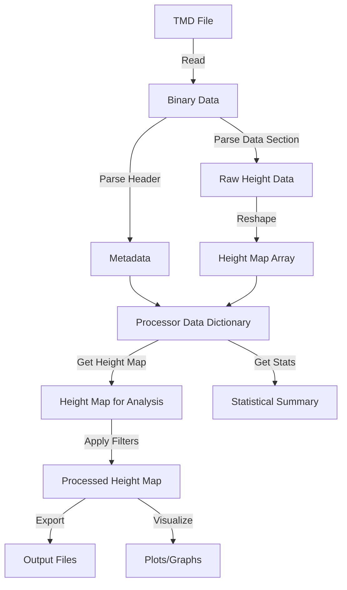
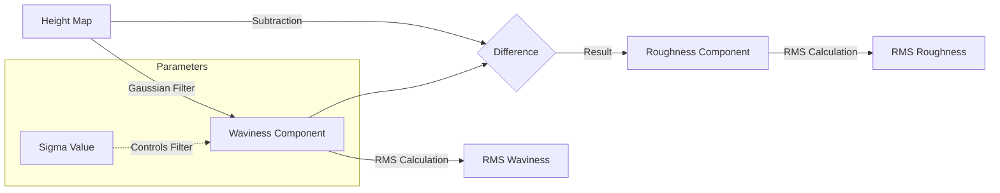
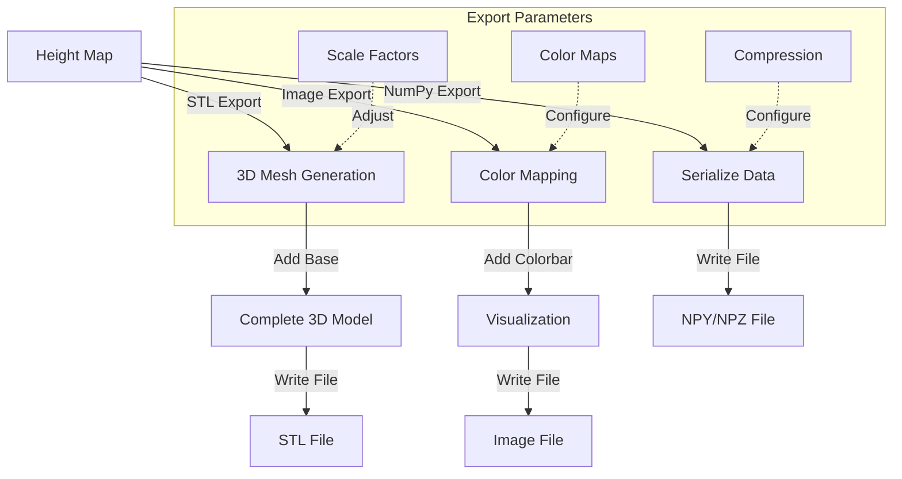
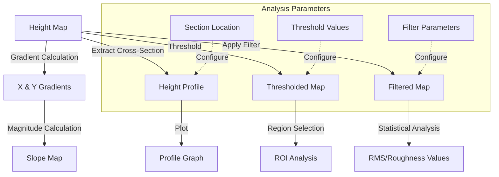
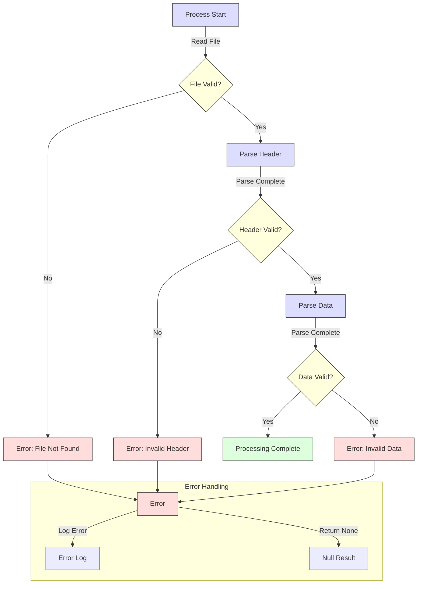
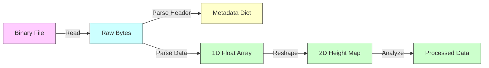
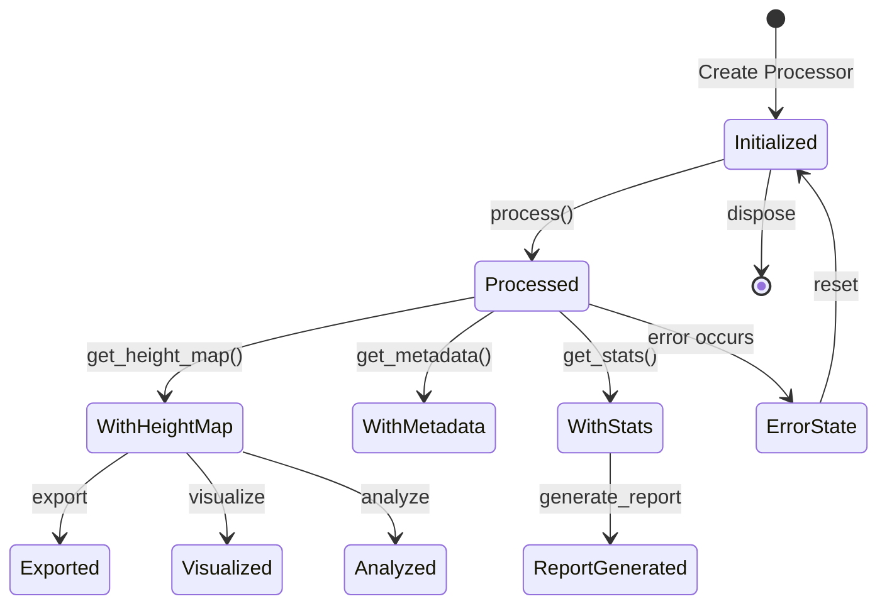

# Data Flow in the TMD Library

This document illustrates how data flows through the TMD library during different operations.

## Basic Processing Flow

The following diagram shows the basic flow of data when processing a TMD file:

## Waviness and Roughness Separation

This diagram illustrates how a height map is separated into waviness and roughness components:

## Export Process Flow

The following diagram shows the data flow during the export process:

## Processing Pipeline for Surface Analysis

This diagram shows the data flow for surface analysis operations:

## Error Handling Flow

This diagram shows how errors are handled during processing:

## Data Type Flow

This diagram shows how data types flow through the system:

## State Diagram for TMDProcessor

This diagram shows the state transitions of a TMDProcessor object:

These diagrams provide a comprehensive view of how data flows through the TMD library, helping users understand its architecture and processing pipeline.
