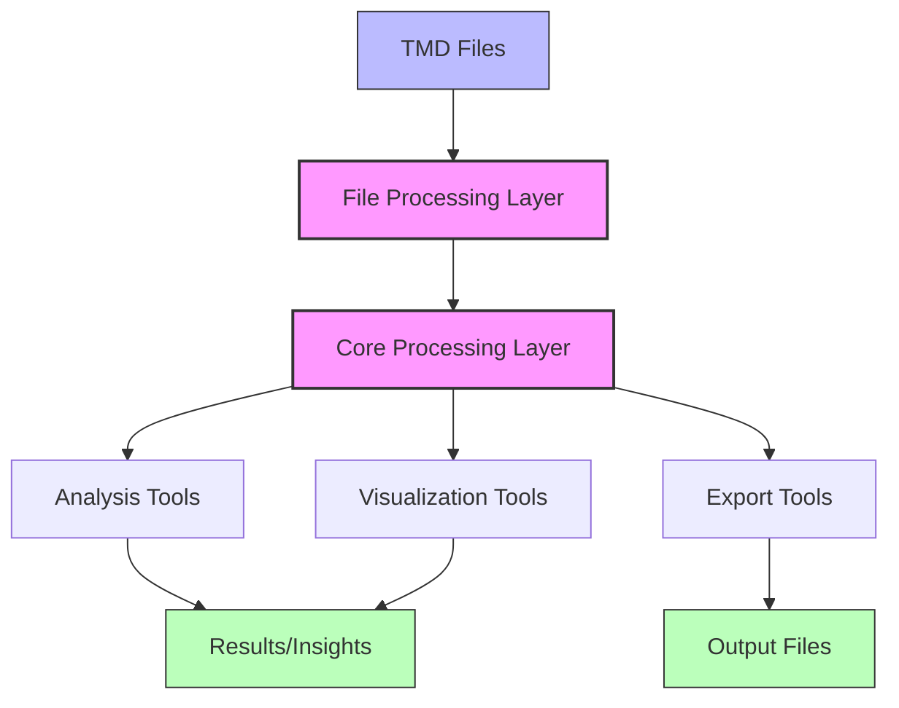
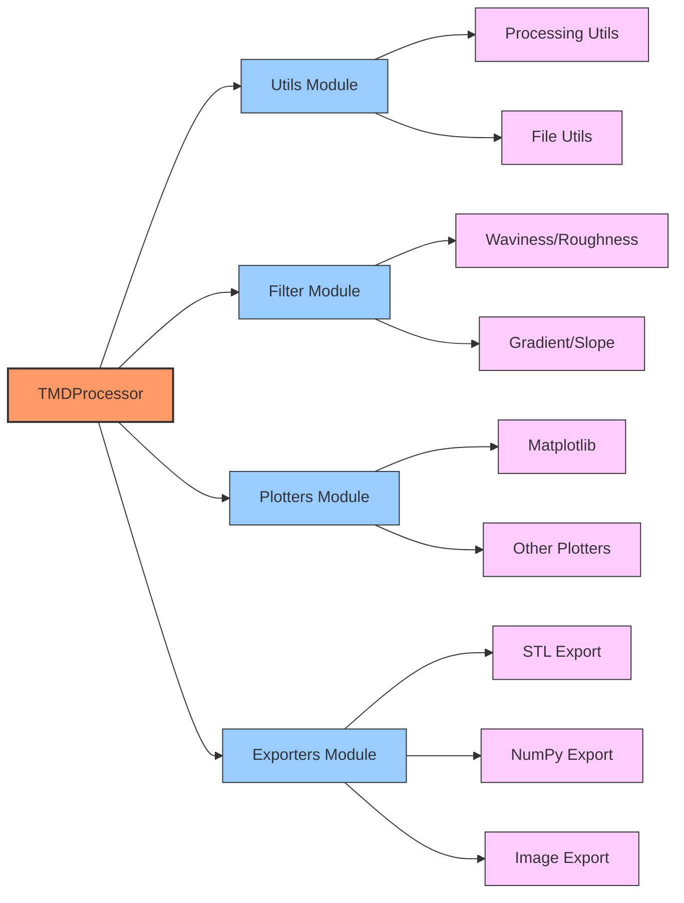
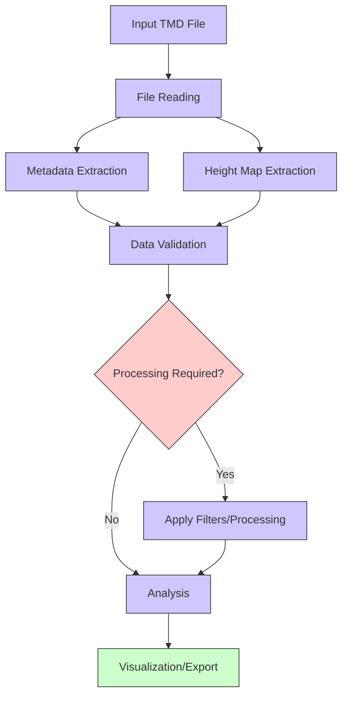
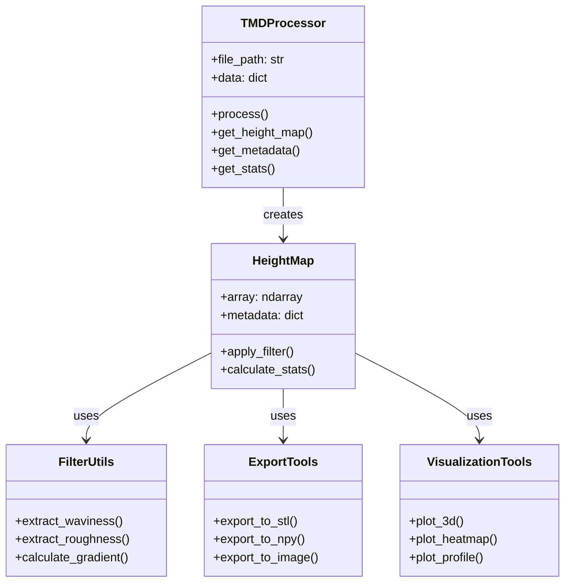
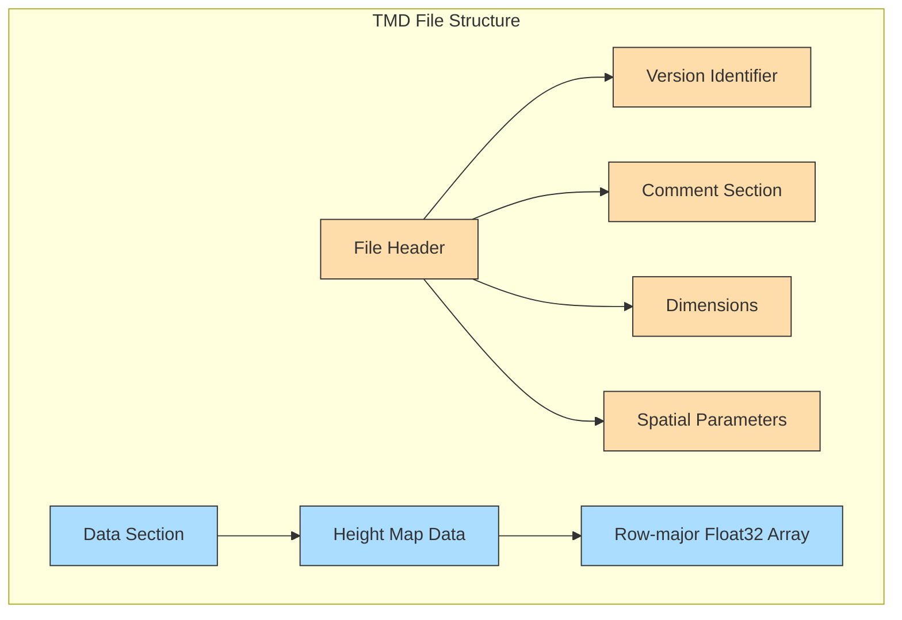

# TMD Architecture Overview

This page provides a high-level overview of the TMD library architecture and its major components.

## Overall Architecture

The TMD library is organized into several layers, from low-level file processing to high-level visualization and analysis tools.

## Key Components

The library consists of several key components that work together to process and analyze TMD files:

## Processing Pipeline

The TMD file processing pipeline consists of several stages from input to output:

## Class Relationships

The following diagram shows the key classes and their relationships:

## File Format Structure

The TMD file format consists of a header section and a data section:

This overview provides a foundation for understanding how the TMD library is structured and how its components interact with each other.
